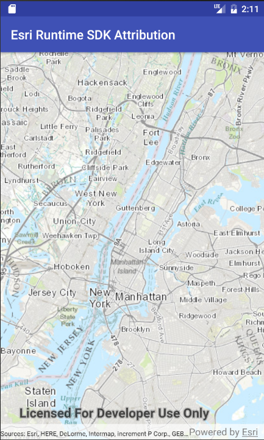

# ArcGIS Attribution

Esri requires that when you use an ArcGIS Online basemap, Esri data services, or Esri API technology in your app you must also include Esri attribution. There are specific requirements for attribution you may be required to address in your app depending on how your app is built and the data it uses. For more specific information, please visit [Attribution in your app](https://developers.arcgis.com/terms/attribution/).

The ArcGIS Runtime SDKs do not offer any API control over the display of map attribution, yet Esri's license agreement requires it. Developers are on their own to show map attribution and conform to their licesne agreement with Esri. As detailed in the [Attribution in your app](https://developers.arcgis.com/terms/attribution/) topic, there are specific rules and restrictions when showing attribution.

The purpose of this project is to demonstrate how to get the attribution for all layers currently assigned to the base map used by the map object. The attribution is displayed on the bottom of the map view.

## Android

## iOS

## .NET

